# 🛍️ ShopEase — Local Shop Product Finder

ShopEase is a hyperlocal commerce platform that connects customers with nearby local shops. Search for products, compare prices, check live stock, save wishlists, rate shops, and chat with shop owners — all in one place.

---

## 📸 Screenshots

### 🏠 Home & Auth
| Homepage | Login Page | Sign Up / Register Shop |
|----------|------------|-------------------------|
| 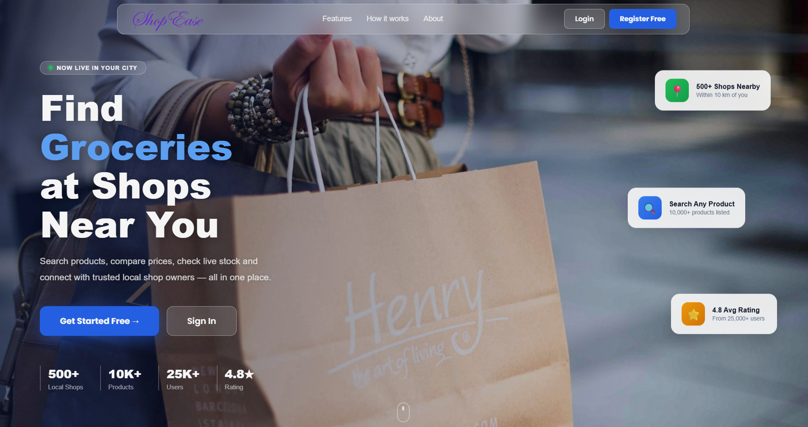 | 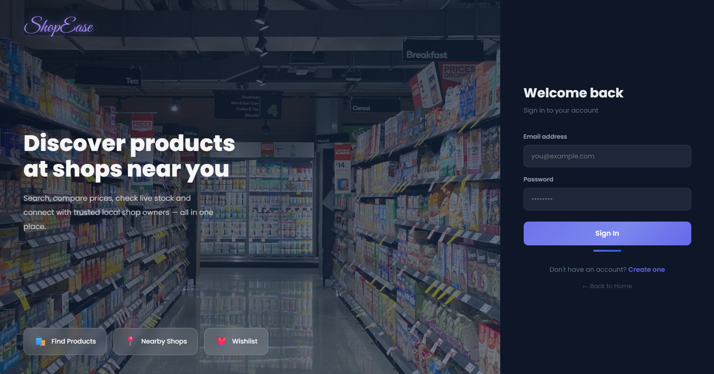 | 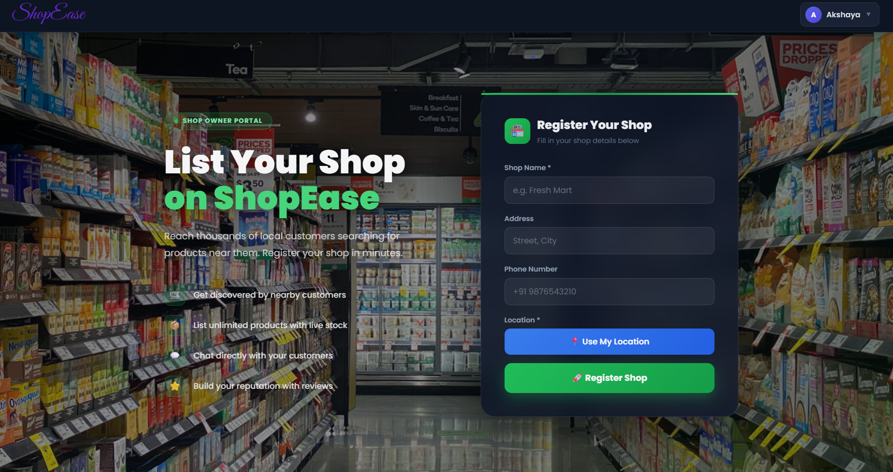 |

### 👤 Customer
| Customer Dashboard | List of Shops | Shop Details on Map |
|--------------------|---------------|---------------------|
| 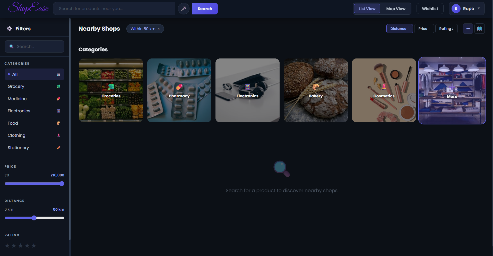 | 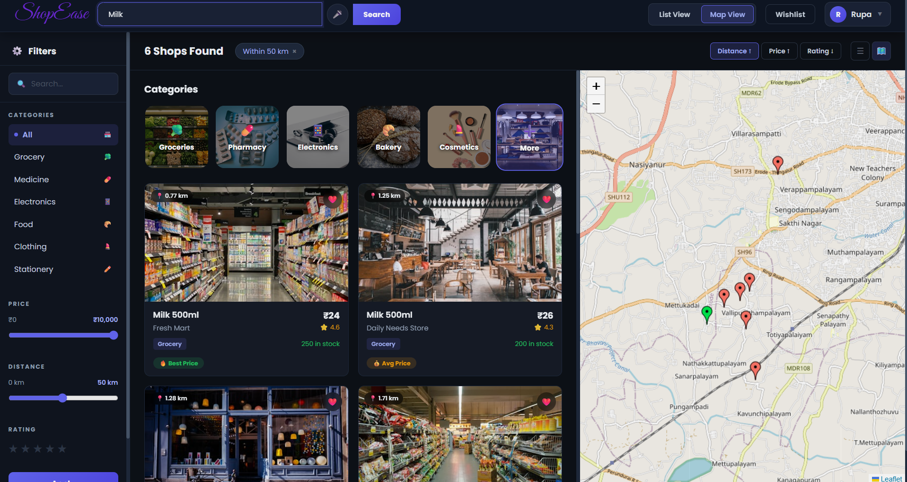 |  |

| Shortest Route | Wishlist | Recommendations |
|----------------|----------|-----------------|
| 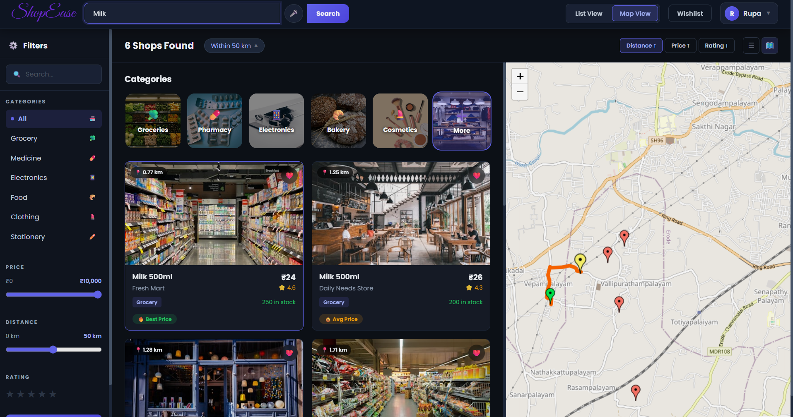 | 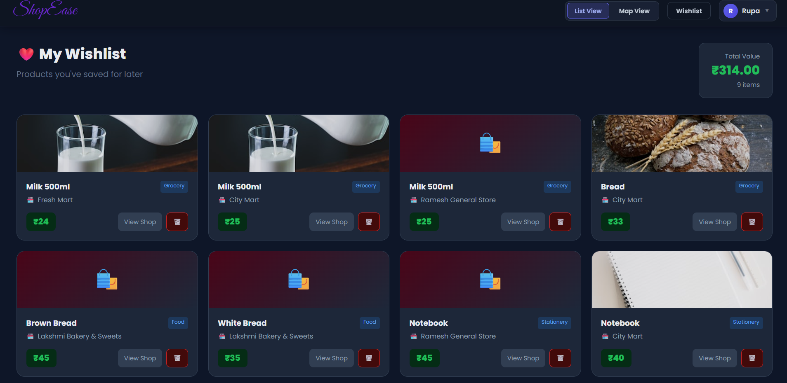 | 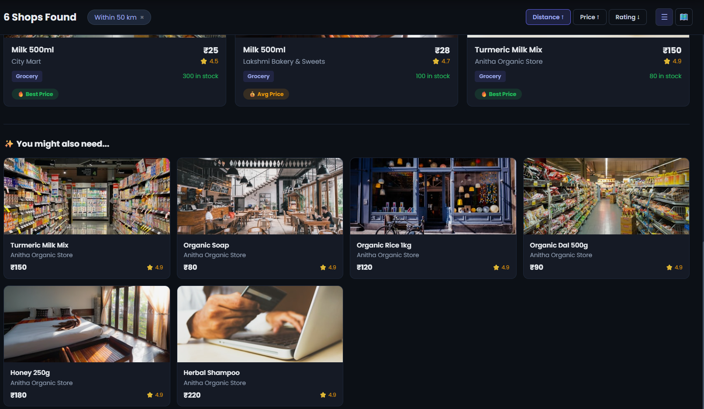 |

### ⭐ Reviews & Chat
| Shop Reviews | Review Page | Chat (Customer) | Chat (Shop Owner) |
|--------------|-------------|-----------------|-------------------|
| 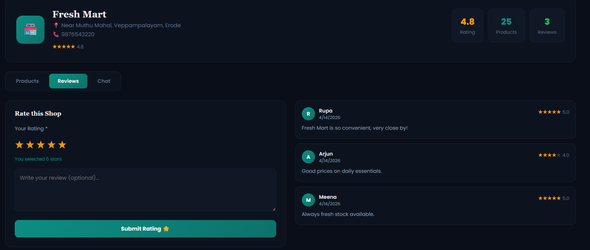 |  | 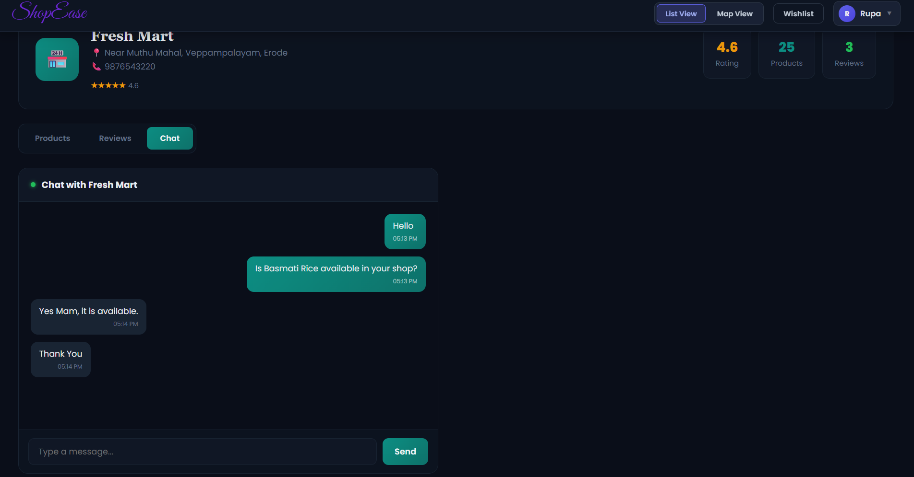 | 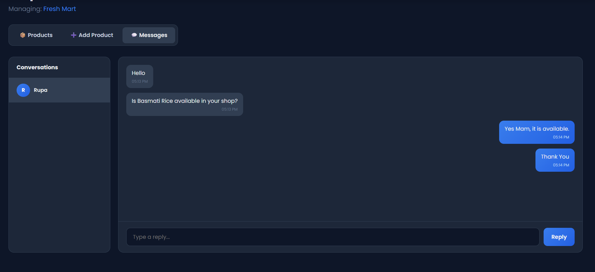 |

### 🏪 Shop Owner
| Shop Dashboard | Add Product | View Shop |
|----------------|-------------|----------|
| 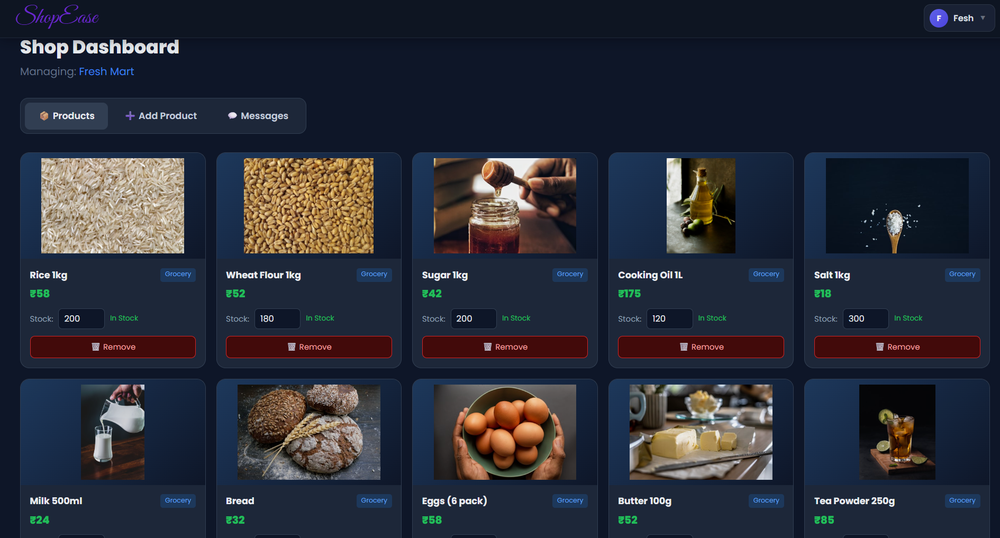 | 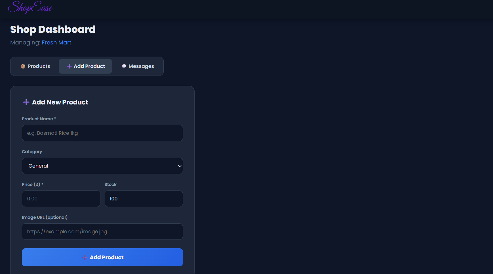 | 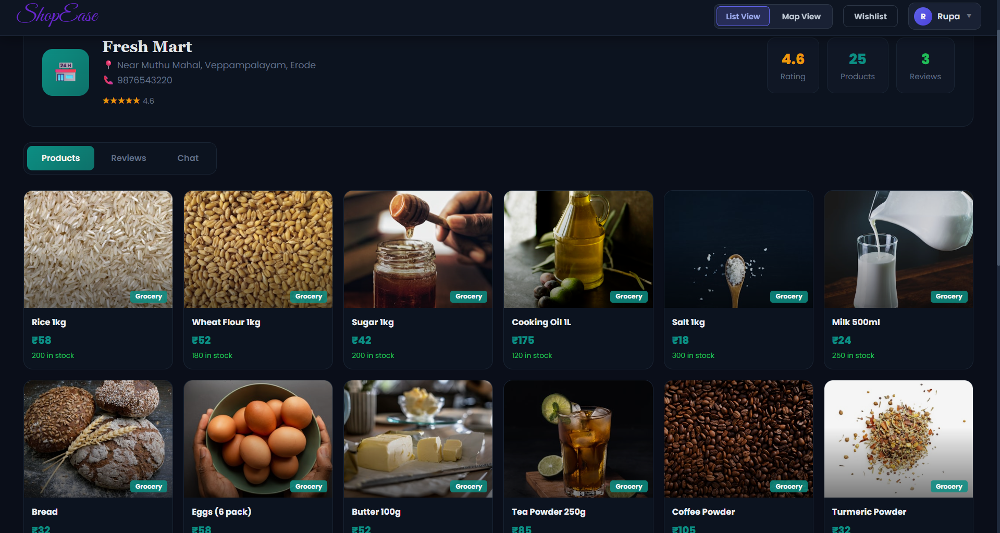 |

---

## 📸 Features at a Glance

### 👤 Customer
- 📍 GPS-based product search within 100 km
- 🗺️ Interactive map view with route drawing (Leaflet + OSRM)
- 💰 Price badges — **Best Price / Avg Price / Pricey**
- 🔍 Autocomplete search suggestions
- ❤️ Wishlist (add/remove products)
- ⭐ Rate and review shops
- 💬 Real-time chat with shop owners
- 🏪 Shop detail page with products, reviews, and chat

### 🏪 Shop Owner
- 📌 Register shop with GPS location
- ➕ Add, edit, and delete products
- 📦 Live stock management
- 💬 View and reply to customer messages

---

## 🗂️ Project Structure

```
Localshop_product_finder/
├── backend/          # Express.js REST API + SQLite database
│   ├── routes/       # auth, customer, shop, messages, ratings
│   ├── db.js         # Database setup
│   ├── seed.js       # Sample data seeder
│   └── server.js     # Entry point
└── frontend/         # React + Vite client
    └── src/
        ├── components/   # Navbar
        └── pages/        # Home, Login, Signup, CustomerDashboard,
                          # ShopDashboard, ShopDetail, Wishlist
```

---

## 🛠️ Tech Stack

| Layer    | Technology                          |
|----------|-------------------------------------|
| Frontend | React 19, Vite, React Router DOM v7 |
| Maps     | Leaflet.js, React-Leaflet, OSRM API |
| HTTP     | Axios                               |
| Backend  | Node.js, Express.js                 |
| Database | SQLite (better-sqlite3)             |
| Auth     | JWT (jsonwebtoken), bcryptjs        |

---

## 🚀 Getting Started

### Prerequisites
- Node.js v18+
- npm

### 1. Clone the repository
```bash
git clone https://github.com/your-username/localshop-product-finder.git
cd localshop-product-finder
```

### 2. Install dependencies
```bash
# Backend
cd backend && npm install

# Frontend
cd ../frontend && npm install
```

### 3. Seed the database (optional)
```bash
cd backend
node seed.js
```

### 4. Start the backend
```bash
cd backend
node server.js
# Runs on http://localhost:5000
```

### 5. Start the frontend
```bash
cd frontend
npm run dev
# Runs on http://localhost:5173
```

---

## 🔌 API Reference

| Method | Endpoint | Description |
|--------|----------|-------------|
| POST | `/api/auth/signup` | Register user |
| POST | `/api/auth/login` | Login, returns JWT |
| POST | `/api/shop/add` | Register shop |
| GET | `/api/shop/my-shop` | Get owner's shop |
| GET | `/api/shop/:id` | Get shop by ID |
| PUT | `/api/shop/update-stock` | Update product stock |
| POST | `/api/shop/add-product` | Add product |
| DELETE | `/api/shop/delete-product/:id` | Delete product |
| GET | `/api/customer/search` | Search products by location |
| GET | `/api/customer/suggest` | Autocomplete suggestions |
| GET | `/api/customer/price-stats` | Price averages per product |
| GET | `/api/customer/recommendations` | Recommended products |
| POST | `/api/wishlist/add` | Add to wishlist |
| GET | `/api/wishlist/:user_id` | Get wishlist |
| DELETE | `/api/wishlist/remove/:id` | Remove from wishlist |
| POST | `/api/ratings/shop/:shop_id` | Submit rating |
| GET | `/api/ratings/shop/:shop_id` | Get shop ratings |
| POST | `/api/messages/send` | Send message |
| GET | `/api/messages/conversation` | Get conversation |
| GET | `/api/messages/shop/:shop_id` | Get all shop conversations |

---

## 👥 User Roles

| Role | Access |
|------|--------|
| Customer | Search products, wishlist, rate shops, chat |
| Shop Owner | Manage shop, products, stock, reply to messages |

Role is selected at signup and encoded in the JWT token.

---

## ⚙️ Environment Variables

Create a `.env` file in the `backend/` directory:

```env
JWT_SECRET=your_secret_here
PORT=5000
```

> ⚠️ Set a strong `JWT_SECRET` in your `.env` before deploying to production.

---

